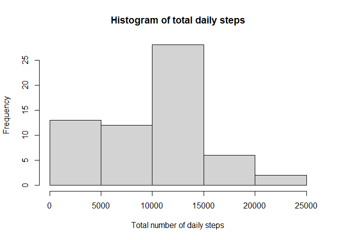
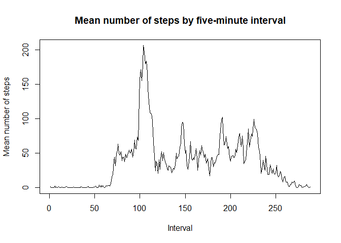
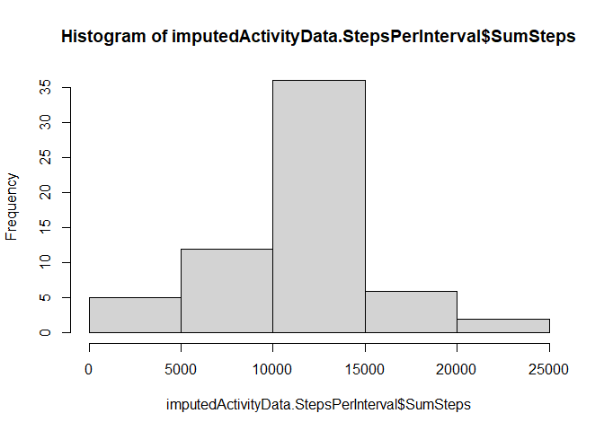
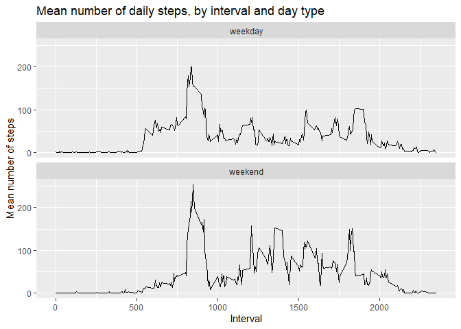

Reproducible Research: Peer Assessment 1
================
Richard D. Wilkinson
02/11/2020

# Activity data assignment

*This was the first of two peer-reviewed assignments for the
[‘Reproducible
Research’](https://www.coursera.org/learn/reproducible-research)
Coursera course. The original assignment instructions can be found
[here](https://github.com/rdwilkinson/Peer_Assignment1/blob/master/Assignment%20instructions.md).*

## Open the dataset

Load the data…

``` r
activityData <- read.csv("data/activity.csv")
```

There are three variables available.

``` r
names(activityData)
```

    ## [1] "steps"    "date"     "interval"

## Mean steps per day

First, calculate the total number of steps for each day in the dataset
(excluding missing values) using the dplyr library.

``` r
library(dplyr)
activityData.StepsPerDay <- activityData %>% 
  group_by(date) %>% 
  summarise(TotalSteps = sum(steps, na.rm = TRUE))

head(activityData.StepsPerDay)
```

    ## # A tibble: 6 x 2
    ##   date       TotalSteps
    ##   <chr>           <int>
    ## 1 2012-10-01          0
    ## 2 2012-10-02        126
    ## 3 2012-10-03      11352
    ## 4 2012-10-04      12116
    ## 5 2012-10-05      13294
    ## 6 2012-10-06      15420

Then, produce a histogram of total daily steps. The mean daily step
count was **9354.23**, whereas the median daily step count was
**10395**.

``` r
hist(activityData.StepsPerDay$TotalSteps, 
     main = "Histogram of total daily steps",
     xlab = "Total number of daily steps")
```

<!-- -->

## What is the average daily activity pattern?

First, get the average number of steps for each five-minute interval
(excluding missing values).

``` r
activityData.StepsPerInterval <- activityData %>% 
  group_by(interval) %>% 
  summarise(MeanSteps = mean(steps, na.rm = TRUE))

head(activityData.StepsPerInterval)
```

    ## # A tibble: 6 x 2
    ##   interval MeanSteps
    ##      <int>     <dbl>
    ## 1        0    1.72  
    ## 2        5    0.340 
    ## 3       10    0.132 
    ## 4       15    0.151 
    ## 5       20    0.0755
    ## 6       25    2.09

Then, display a time-series graph of these averages.

``` r
plot(activityData.StepsPerInterval$MeanSteps, type = "l", 
     main = "Mean number of steps by five-minute interval", 
     xlab = "Interval", ylab = "Mean number of steps")
```

<!-- -->

Which is the interval with the highest number of average steps across
all the days?

``` r
interval_max <- activityData.StepsPerInterval$interval[which.max(activityData.StepsPerInterval$MeanSteps)]
print(interval_max)
```

    ## [1] 835

## Imputing missing values

What is the total number of rows with missing values?

``` r
sum(!complete.cases(activityData))
```

    ## [1] 2304

Impute missing values by using the mean of each interval over the whole
period. First, merge the averages calculated previously with the
original data. Then, replace all NAs with the mean values.

``` r
imputedSteps <- merge(activityData, activityData.StepsPerInterval, by.x = "interval")
imputedSteps$steps <- ifelse(is.na(imputedSteps$steps), imputedSteps$MeanSteps, imputedSteps$steps)
head(imputedSteps)
```

    ##   interval    steps       date MeanSteps
    ## 1        0 1.716981 2012-10-01  1.716981
    ## 2        0 0.000000 2012-11-23  1.716981
    ## 3        0 0.000000 2012-10-28  1.716981
    ## 4        0 0.000000 2012-11-06  1.716981
    ## 5        0 0.000000 2012-11-24  1.716981
    ## 6        0 0.000000 2012-11-15  1.716981

What is the impact of the imputation? Recaculate the total number of
daily steps using the imputed data and show a histogram.

``` r
imputedActivityData.StepsPerInterval <- imputedSteps %>% 
  group_by(date) %>% 
  summarise(SumSteps = sum(steps))

hist(imputedActivityData.StepsPerInterval$SumSteps)
```

<!-- -->

What are the new means and medians? The (rounded) mean for the imputed
data is **10766.19** and the new (rounded) median is **10766.19**.

What’s the difference between these and those from the original data?
The (rounded) difference between the means is **1411.96**, whereas the
difference between the medians is **371.19** The data imputation
technique increased both the mean and the median daily step count.

## Were there different activity patterns on weekdays and weekends?

First, check whether each date was a weekday or weekend.

``` r
imputedSteps$day <- as.POSIXlt(imputedSteps$date)$wday + 1

imputedSteps$day <- ifelse(imputedSteps$day < 6, "weekday", "weekend")
imputedSteps$day <- as.factor(imputedSteps$day)

head(imputedSteps[,3:5])
```

    ##         date MeanSteps     day
    ## 1 2012-10-01  1.716981 weekday
    ## 2 2012-11-23  1.716981 weekend
    ## 3 2012-10-28  1.716981 weekday
    ## 4 2012-11-06  1.716981 weekday
    ## 5 2012-11-24  1.716981 weekend
    ## 6 2012-11-15  1.716981 weekday

Then, produce a time-series graph with a facet for mean weekday and
weekend steps by 5-minute interval.

``` r
imputedActivityData.StepsPerInterval2 <- imputedSteps %>% 
  group_by(interval, day) %>% 
  summarise(MeanSteps = mean(steps))

imputedSteps$date <-as.Date(imputedSteps$date)

library(ggplot2)
ggplot(data = imputedActivityData.StepsPerInterval2, 
       aes(x = interval, y = MeanSteps)) +
  geom_line() + 
  facet_wrap(~ day, ncol = 1) +
  labs(x = "Interval", y = "Mean number of steps", 
       title = "Mean number of daily steps, by interval and day type")
```

<!-- -->
